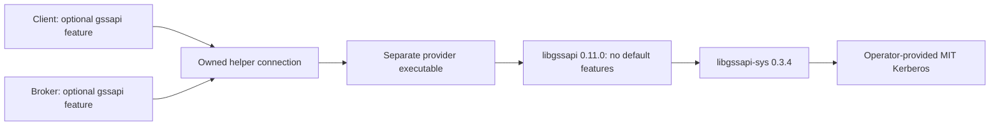

# Proposed Kerberos provider

KL06-08 is awaiting maintainer approval. This proposal adds an optional
GSSAPI/Kerberos provider for the client and broker. It does not approve a
production profile or add a dependency today.

Use a separate helper process with `libgssapi = 0.11.0`,
`default-features = false`, and a pinned `libgssapi-sys = 0.3.4`. The first
qualification target is x86_64 Linux with MIT Kerberos. Force the MIT
implementation at build time instead of accepting whichever library is found.
Keep native bindings in the helper; the client and broker continue to forbid
unsafe Rust. Do not add Cyrus SASL or change default features.

The helper process gives the connection owner a way to cancel a native call that
blocks on credential acquisition or KDC I/O. Aborting a Rust task or a blocking
thread is insufficient. The owner must request termination and retain its
resource reservation until the child is actually waited. Explicit close and
caller deadlines need separate outcomes; a cancellation request is not proof of
completion. Measure helper startup and authentication cost during qualification.

## Reviewed options

The source review uses immutable registry archives and their SHA-256 checksums.
It checks manifests and the relevant context/credential implementations. None of
these packages was installed, compiled, or run for this review.

| Candidate | License | Relevant source behavior | Decision |
|---|---|---|---|
| libgssapi 0.11.0 + libgssapi-sys 0.3.4 | MIT | Client and server contexts, mutual-auth flags, wrap/unwrap, credential lifetime; synchronous native calls. Empty default feature set. | Proposed first Linux backend in an owned helper process. |
| cross-krb5 0.5.0 | MIT | Unix libgssapi and Windows SSPI adapters. Defaults enable IOV, which the underlying Apple implementation cannot provide. | Keep as a later portability candidate; it does not establish tested Windows or macOS support. |
| sspi 0.23.0 | MIT OR Apache-2.0 | Client and server Kerberos contexts; caller-driven network generators; AES integrity-only wrapping. Includes additional protocols and prerelease cryptography pins. | Keep as an alternative. Native credential-cache/keytab behavior and Kafka SASL negotiation remain unqualified. |
| rsasl 2.3.1 | MIT OR Apache-2.0 | Client/server RFC 4752 negotiation over libgssapi 0.7.2. Its default features include native GSSAPI. | Do not replace the existing SASL engine or enable these defaults. Use its source as an additional protocol reference. |
| picky-krb 0.13.0 | MIT OR Apache-2.0 | Kerberos message encodings and cryptographic building blocks. | Not a complete credential/context provider on its own. |

Build and test with latest stable Rust only. Upstream minimum-version metadata
is retained in the source audit; it is not a project compatibility target.
The inspected source does not prove build compatibility or runtime correctness.

## Proposed dependency and ownership graph

The client/broker feature adds only the bounded helper transport and GSSAPI
mechanism handling. Native libraries are loaded by the separate executable.
The helper must use safe process APIs, forbid unsafe Rust in its own source,
and keep the native bindings in reviewed dependencies. Use a private pipe or
socket; stdout carries only bounded protocol frames, never diagnostic tokens.

The helper has one security context per connection and processes its steps
serially. Do not share a mutable context across broker connections. Reserve
context, input, output, and child-process capacity before spawning. Refuse
admission when the configured budget is exhausted. The first profile proposes
64 KiB per token, at most 16 exchange steps, and one child per active handshake;
these limits must be checked against actual Java/KDC exchanges before release.
No unbounded background refresh or credential cache is introduced.

The child checks its expected parent identity and uses parent-death protection
where supported. Cancellation, helper failure, peer disconnect, oversized output,
and the original connection deadline all close admission. Explicit shutdown
waits the child; last-owner Drop initiates cancellation and leaves an owned reaper
responsible for the wait. A process still awaiting termination keeps its budget
reservation and remains visible in bounded diagnostics.

## Mechanism contract

Select the Kerberos V5 mechanism explicitly; do not fall back to NTLM, SPNEGO,
PLAIN, or another SASL mechanism. Resolve the service principal from explicit
operator configuration and the broker's advertised host. A TLS server name and a
Kerberos principal are separate settings. Disable credential delegation.

Run the Kafka SASL framing negotiated with the peer, retaining an explicit
unsupported outcome for peers outside the qualified frame/version profile.
Exchange GSS tokens until the context is complete and verify the requested mutual
authentication and integrity properties. Then perform the RFC 4752 protected
security-layer negotiation, select authentication-only mode, and check the final
authorization identity. Kafka records are not wrapped in a new SASL data layer;
use TLS for transport confidentiality. Authenticate the full principal before
applying an operator-approved principal mapping and ACL checks.

All steps share the original connection deadline. A helper exit, expired ticket,
wrong principal, invalid layer token, or unavailable credentials fails closed.
Peer session lifetime and ticket lifetime are distinct: qualification must test
both expiry and supported reauthentication/reconnect behavior through actual
Producer, Consumer, group/share, and Admin connections.

The first credential profile consumes an operator-owned credential cache for the
client and an operator-owned service keytab for the broker. Pass their selectors
only to the child's environment/configuration. Do not change process-global
Kerberos variables, persist credentials, export tickets, or perform delegation.
Read provider-reported credential/context lifetime and reacquire for a new
handshake after expiry. Keytab rotation and external cache renewal require named
behavioral tests. Password acquisition, S4U, credential export, and smart cards
are outside this first profile.

Tokens, keytab content, cache content, credential paths, and native error text
must not appear in logs, errors, Debug output, metrics labels, or evidence.
Return fixed error classifications and bounded numeric status codes. Principal
values used for authorization are not telemetry labels.

## Before implementation is qualified

Approval chooses this backend and process boundary. It does not waive the
remaining source, license, build, or interoperability checks.

- Pin the complete helper build graph and actual system library/package closure;
  review native and Cargo licenses separately. The observed Debian installation
  has MIT Kerberos 1.21.3-5+deb13u1 and keyutils 1.6.3-6. This is an observation,
  not a completed dependency approval or a portable runtime guarantee.
- Build the helper on latest stable Rust and run an isolated, owned MIT KDC with
  pinned Kafka Java 4.1.2, 4.2.1, and 4.3.1 peers in both client/server directions.
- Test expired and renewed tickets, wrong service/realm/principal, unavailable
  credentials/KDC, keytab rotation, replayed/malformed tokens, authorization
  mapping, supported session expiry, and cancellation during each native step.
- Prove child waits, process/connection budgets, redaction, and bounded shutdown.
  Measure authentication/reconnect overhead; do not infer data-plane speed from
  this source review.
- Keep macOS, Heimdal, Windows/SSPI, delegation, and password/smart-card profiles
  unqualified until separately tested.

KL06-09 implements the approved client exchange, KL06-10 qualifies expiry and
reconnect, and KL11-38 implements the approved broker boundary. Enterprise
profile completeness stays blocked while this decision or its qualifications
remain open. The source audit is in
[the review evidence](evidence/security/gssapi-boundary/README.md).
