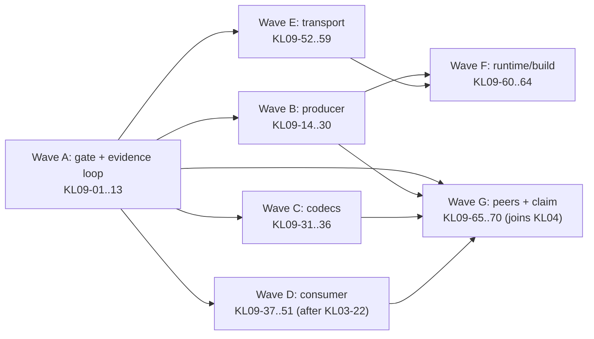

# KL09: performance leadership program

**Goal:** make `partitionline` the fastest Kafka client, then prove it with
evidence strong enough for a named, reproducible claim. This page holds the
strategy, the measurement cells and the worker protocol for the **KL09**
lane. [tasks.json](tasks.json) holds KL09 status and dependencies, like
every other lane. Work proceeds one card per session under the
[session guide](README.md).

Nothing here is a performance claim. The numbers in section 2 are dated
historical evidence. Targets are **proposed** until KL09-01 freezes them.
**Suite HOLD remains** until the existing signoff process lifts it.

## 0. Scope and claim definitions

`partitionline` implements the Kafka **client** side of the protocol:
producer, consumer, groups, share groups, transactions and admin. Here,
"fastest Kafka implementation" means the fastest Kafka **client runtime**,
measured at equal semantics against the strongest named peers. A broker
(replication, log storage, controller) is out of scope. It would be a
separate program with its own scope decision;
[ROADMAP §2](../ROADMAP.md#2-scope-and-promotion-gates) excludes
broker-internal APIs from the client profiles.

"Fastest" has four dimensions:

- **throughput**: acknowledged records/s and MB/s produced, and verified
  records/s consumed
- **latency**: open-loop p50, p99 and p99.9 at declared offered loads
- **efficiency**: CPU-seconds per million records, allocations per record
  and peak RSS
- **breadth**: plaintext, TLS and SASL; every Kafka codec including zstd;
  idempotent and transactional work; groups and share groups; 1 to 64 or
  more partitions; x86_64 and arm64

### Claim types (KL09-01 freezes these)

"Superior" means statistically superior to the **best peer for that
cell**. For throughput, the paired 95% CI lower bound of the
partitionline/peer ratio must be above 1.0. For latency, the CI upper bound
of each percentile ratio must be below 1.0 at every declared load. Peers
that lack a capability follow the existing
[non-win rule](../benchmark-contract.md#8-explicitly-unsupported-peer-cell-and-non-win-scoring-rules):
such a cell is compared against the best peer that supports it, or listed
as excluded. It is never counted as a win.

| Claim wording | Requirement |
|---|---|
| **"Fastest Kafka client"** (global) | Superior in **every** required cell of **all six** contract profiles (low-latency, bulk, fetch, transactional, group/share, secure), plus the required compressed cells (lz4, zstd), on **both** x86_64 and arm64, independently reproduced (KL04-14). **No exceptions.** Any losing, tied or not-run required cell blocks this wording. |
| **"Fastest for <profile> on <arch>"** | Superior in every required cell of that profile on that architecture, independently reproduced |
| **"X% faster"** (cell or profile) | The paired 95% CI lower bound of the throughput ratio is at least 1+X in every covered cell. For latency, the percentile ratio's CI upper bound is at most 1−X. |
| **"Most CPU-efficient"** | The CPU-per-record ratio's CI upper bound is at most 0.80 against the best peer. This is **never** worded as "fastest". |
| ROADMAP **performance-leadership scorecard** | The throughput ratio's CI lower bound is at least 1.20, **or** the CPU-per-record CI upper bound is at most 0.80, with the p99 ratio's CI upper bound at most 1.05 at matched load ([scorecard](../ROADMAP.md#3-scorecard)) |
| Anything weaker | Dated per-cell verdicts with every loss listed; no summary claim |

### Claim ladder

| Level | Evidence | Produced by | What it permits |
|---|---|---|---|
| L0 | Microbenchmark, allocation or instruction-count change at a pinned SHA | KL04-09, KL09-04/05, optimization cards | Internal engineering notes only |
| L1 | Client ceiling against the null broker | KL09-06..10, KL09-66/67 | "Client-side CPU headroom versus peer P on this host." Exploratory; **never** a Kafka throughput claim. |
| L2 | Local real-broker cells, paired and repeated | Optimization cards, KL09-12/13/69 | Local and unsigned; engineering direction only |
| L3 | Controlled x86_64 **and** arm64 campaigns | KL04-08/10/11/12, KL09-68 | Dated per-cell comparison with all losses listed |
| L4 | Independent reproduction plus Suite HOLD process | KL04-14, KL09-70 | The strongest claim type in the table above whose requirement is met |

### Peer set

| Peer | Why | Card |
|---|---|---|
| librdkafka C (current pinned release, plus the 2.15.0 historical bar) | The de facto native reference | KL04-04 |
| Apache Java `kafka-clients` (pinned) | The reference implementation, with heavily tuned batching | KL04-03 |
| **franz-go** (pinned) | Widely regarded as one of the fastest non-C clients; needed for a global claim | KL09-65 |
| rust-rdkafka | The Rust status quo, reported separately from the C-only bar | KL04-05 |
| One semantically comparable pure-Rust peer (selected in KL04-05) | Same-language baseline | KL04-05 |

### Proposed primary metrics and guardrails

| Profile | Primary metric | Guardrails |
|---|---|---|
| bulk (acks=1; idempotent acks=all; none/lz4/zstd) | HW-verified acknowledged rec/s and MB/s | CPU per record; p99 ack latency at matched load; RSS within the declared budget |
| fetch (6 and 64 partitions; read_uncommitted and read_committed) | ID/hash-verified consumed rec/s and MB/s | CPU per record; RSS |
| low-latency (open-loop; acks=1 and acks=all) | p50/p99/p99.9 at 10%, 50% and 80% of the weakest peer's saturation, plus the maximum load under the p99 budget | Schedule lag; timeouts and rejections |
| transactional; group/share | Contract cells (commit cycles/s; KIP-848 steady consumption) | Correctness histories (KL03) |
| secure (TLS 1.3; SCRAM-SHA-256) | As for bulk | Handshake and reauthentication counted separately |
| client ceiling (null broker; exploratory) | Records/s per client core | Zero server-side validation failures; never quoted as Kafka throughput |

These internal engineering targets are **not claims**:

- amortized steady-state produce allocations of at most 0.01 per record
- zero per-record allocations on the additive fetch batch-view path
- idle producer RSS proportional to active partitions, not to configured
  connection slots

## 1. Why a separate lane

KL04 is correctly **qualification-first**. Its only optimization step,
KL04-13, comes last on a long critical path:

```
KL04-03/04/05/06/07 → KL04-08 → KL04-10/11 (also KL03-19/20 fault histories)
  → KL04-12 → KL04-13 (≤3 optimization cards)
```

That ordering is right for **claims** but too slow for **engineering**.
KL09 lets optimization proceed on local, deterministic evidence while KL04
builds the claimable evidence:

- microbenchmarks
- allocation and instruction counts
- a validating null-broker client ceiling
- local broker cells

The lanes join at KL09-68/70. KL09 cards never publish a claim; only
KL04-12, KL04-14 and KL09-70 can.

## 2. Where we are (dated; source `19b4399`, 2026-09-26)

| Evidence | Result | Standing |
|---|---|---|
| Lab A produce, 8e6×100 B, against librdkafka **2.15.0 C** ([benchmark.md](../benchmark.md#results)) | 6.17M vs 4.94M rec/s (acks=1, 2026-08-25). Idempotent: 7.16M vs 3.13M. TLS: 7.42M vs 1.52M. | Historical Lab A. It predates the frozen contract: no warmup and repeated-byte payloads. |
| Fetch, 8e6×100 B, against rust-rdkafka 0.39.0 | 5.28M vs 0.90M rec/s | this-VM, **unsigned**. The peer polled one record per call, so this is not a C bar. |
| Sequential produce-ack latency against rust-rdkafka 0.39.0 | p50 62 vs 58 µs; p99 95 vs 90 µs | this-VM, unsigned. **A loss.** Closed-loop, not open-loop. |
| [Contract](../benchmark-contract.md) cells | 9 required and 6 exploratory cells, all `not_run` | No claimable evidence yet |
| Microbenchmarks, allocation and instruction counts, profiler scripts | **None** in the repository | KL04-09, KL09-04/05/11 |
| `bench_produce` against the matched scenario | The scenario passes `WARMUP`/`BATCH_SIZE`, which the driver ignores. The driver also uses repeated-byte payloads and a hard-coded 1,000,000-byte batch. | Evidence-integrity gap (KL09-02) |

**Reading:** the bulk-produce design is already strong. It uses sharded
per-connection workers and pipelined requests. For classic Produce
(v3–v8) it copies each payload once; flexible v9+ adds a second
full-batch copy (KL09-15). That explains the historical produce results.

The measurable gaps are:

- latency, a known loss
- per-record bookkeeping on the ack and metrics path
- consumer per-record allocations, no prefetch overlap and no incremental
  Fetch
- missing zstd
- no efficiency measurement at all

## 3. Hot-path map (source hypotheses; KL09-13 ranks them by measurement)

Line numbers are hints at `19b4399`; re-locate code by function name.
**R** = per record, **B** = per batch, **Q** = per request.

### Producer

| Step | Location | Observed cost | Card |
|---|---|---|---|
| Header-blind size estimate | `estimate()` = key + value + 64 (`producer.rs` ~4191), used by `batch_ready`/`take_count` | Header-heavy batches can exceed `batch_bytes`/`max_request_size`, a **possible bound violation** | **KL09-14 (P0)** |
| Flexible (v9+) Produce encode | `encode_produce_body` (~4266–4355) | **New `BytesMut` per partition batch plus a full copy** into the request (B) | KL09-15 |
| Ack completion | `wait_one` (~3701–3900); `record_metadata` (~4506) | `RecordMetadata` and topic `String` built **per record even for `try_send` with no interceptors** (R) | KL09-16 |
| Per-topic metrics tracker | `Shared::topic_tracker` (~941–947) | `parking_lot::Mutex<HashMap>` lookup plus `Arc` clone (R) | KL09-17 |
| Ack-latency sampling | `note_ack_latency` (~1076); `metrics.rs` ~189–250 | Clock read plus 2 atomic latency trackers (R) | KL09-18 |
| Readiness and expiry | `batch_ready`/`take_count` (~4143–4190); `purge_expired_pending` (~3306) | Full pending scan per loop iteration; HashMap insert plus `Arc` clone per record; `Vec::remove` shifting (R, up to O(n²) per batch) | KL09-19 |
| Linger wait ignores in-flight responses | `Worker::run` `select!` (~3387–3467) | Received acks wait for linger or new data (p99) | KL09-20 |
| New `Sleep` each iteration | `Worker::run` | Timer registration per loop | KL09-21 |
| Single-topic fast route | `fast_route`/`remember_fast` (~1645–1711); `Cluster::leader` clones the address `String` (`cluster.rs` ~213–238) | Mixed topics fall back to lock, hash and allocation (R) | KL09-22 |
| `send` wraps one record in `send_all` | `send`/`send_all` (~1554–1642) | Singleton `Vec` in and out; duplicate route lookup (R) | KL09-23 |
| Eager worker allocation | `spawn_node_workers` (~2998–3052) | 8 connections × 2 MiB write buffer plus pending slots (RSS) | KL09-24 |
| Eager, sequential slot connects | `spawn_node_workers` / `connect_tls` (`net.rs` ~697) | Every slot opens and negotiates at setup | KL09-25 |
| Grouping per request | `group_pending` (~4112) plus rescans in `encode_produce_body` | HashMap and index vectors (Q) | KL09-26 |
| Response matching | `decode_produce_response` (`api.rs` ~3049–3104) | Topic `String` clones; linear search (Q) | KL09-27 |
| Retry path | `requeue_pendings` (~4020); `retry_one` (~3102) | Metadata work per retried record | KL09-28 |
| Flush | `flush_until` (~2308) | Two full control passes | KL09-29 |
| Per-record mpsc hop | `try_send` → worker `data.recv_many` | Channel send, atomics, possible wakeup (R) | KL09-30 (decision) |
| Compression scratch | `write_record_batch`/`snappy_compress` (`records.rs` ~1680–1943) | Fresh buffers per batch; extra Snappy framing copy (B) | KL09-33 |

### Codecs

| Location | Observed cost | Card |
|---|---|---|
| `buf.rs` ~118–132, ~512–650; `records.rs` ~2231–2289 (decode) | `need()` plus generic `Buf` branches per varint and field (R) | KL09-31 |
| `records.rs` ~1971–2079 (encode) | Record body sized, then varint widths re-derived (R) | KL09-32 |
| `records.rs` ~1643–1787 (decompress) | 8 KiB growth steps; framed Snappy allocates and copies each chunk (B) | KL09-34 |

### Consumer

| Step | Location | Observed cost | Card |
|---|---|---|---|
| Delivered record owns a **cloned topic `String`**; headers decoded eagerly | `FetchedRecord` push (`consumer.rs` ~3040–3070); `share.rs` ~1232; `records.rs` ~2231–2289 | Allocation plus memcpy per record | KL09-37/38/39 |
| Planning lookups clone the topic | `paused`/`completed`/`preferred` `contains(&(topic.clone(), p))` (~2455–2487, ~3616, ~3658) | `String` allocation per lookup | KL09-40 |
| Records decoded before filtering | `fetch.rs` ~2050 → offset/LSO/abort filtering (`consumer.rs` ~2925–3070) | Discarded records are still materialized (R) | KL09-41 |
| No prefetch overlap | `fetch` round (~2415–2505); leftovers only (~3610) | Network wait is serialized with application work | KL09-42 |
| `JoinSet` spawned per leader per round | ~2640–2750 (`JoinSet::new` ~2713) | Task spawn per round | KL09-43 |
| Waits for **all** leaders | ~2640–2750 | A slow leader delays fast ones | KL09-44 |
| Serial connects | `connect_tls_any` (`net.rs` ~679–696) and callers | Setup waits for each dial in turn | KL09-57 |
| Legacy (full) Fetch every round | `FetchMetadata::LEGACY` (`fetch.rs` ~1081) | Full partition list on every request | KL05-06/07 (existing) |
| Pending-queue rescans | ~3616–3660 | Clone, hash and rebuild per capped poll | KL09-45 |
| Accounting and delivered-position scans | ~2218–2245, ~1607; `group.rs` ~1206–1238 | Repeated scans | KL09-46 |
| read_committed intervals | ~2760–3050 | Sort and hash per response | KL09-47 |
| `next_offsets` | ~783; `share.rs` ~421 | Clone and hash per record | KL09-48 |
| Share fetch | `share.rs` ~1132–1258 | Hard-coded 16 records/1 MiB; serial leaders; linear range search per record | KL09-49/50/51 |

### Shared transport

| Location | Observed cost | Card |
|---|---|---|
| `BrokerConn` request encode (`net.rs` ~1100–1126) | Buffer handed off after each RPC | KL09-52 |
| Header encode (`header.rs` ~485–497) | `client_id` and fixed fields re-encoded per request | KL09-53 |
| Write path (`net.rs` ~570–600) | Contiguous `poll_write` with no TLS coalescing policy. Vectored I/O helps **only** if header and body become separate buffers. | KL09-54 (measure first) |
| Stalled-write read pump (`net.rs` ~505–560) | 8 KiB stack buffer copied into `read_buf` | KL09-55 |
| TLS config (`wrap_tls`, `net.rs` ~476) | Root store and `ClientConfig` rebuilt per connection. (The handshake deadline gap was closed by KL06-05 in `19bbd3a`.) | KL09-56 |
| Socket options | TCP_NODELAY on; SO_SNDBUF/SO_RCVBUF not configurable | KL09-58 |
| OIDC on connect (`sasl.rs` ~510–542; `oidc.rs` ~1815–1905) | Fresh token fetch per connection open | KL09-59 |

### Already good; do not re-optimize without new evidence

- Shared `Bytes` payloads, and borrowed record encoding in `encode_pendings`
- Direct classic (v3–v8) batch writes, `recv_many` batching, and a reusable
  2 MiB producer write buffer
- FIFO `VecDeque` correlation (no HashMap), request pipelining and
  TCP_NODELAY
- Hardware CRC32C (SSE4.2/ARMv8 through `crc32c` 0.6.8), computed once per
  batch
- Known-size frame reservation, zero-copy `split_to().freeze()` frames, and
  zero-copy uncompressed payload slices
- Bounded decompression (64 MiB, KL02-03), empty interceptor chains, and
  `tracing` compiled out by default

## 4. Local measurement cells

Every optimization card names one or more of these cells. The cards in the
"Built by" column implement them. Each A/B uses at least 5 interleaved
repetitions (A-B-B-A…) on one host with the frequency policy recorded, and
reports medians with bootstrap 95% CIs. Artifacts must pass
`scripts/benchmark-report.py` or the harness validator. All results are
**local/unsigned**.

| Cell | Built by | Workload | Metrics |
|---|---|---|---|
| `micro-encode`, `micro-decode`, `micro-request`, `micro-compress:<codec>`, `micro-decompress:<codec>` | KL04-09, KL09-04/05 | Codec microbenches with realistic sizes, entropy and header counts | ns/record, bytes/s, allocations, instructions |
| `micro-share-ranges` | KL09-51 (added to the codec bench crate) | 1,000 short share acquisition ranges | ns/record |
| `nb-produce-bulk` | KL09-09 | Null broker; 6 partitions; 100 B seeded payload; acks=1; linger 5 ms; `try_send`+`flush` | rec/s, CPU-ns/record, allocations/record, peak RSS |
| `nb-produce-idem` | KL09-09 | As bulk, idempotent acks=all, max in-flight 5 | As bulk |
| `nb-produce-mixed-topics` | KL09-09 | As bulk across 8 topics round-robin | As bulk |
| `nb-produce-headers` | KL09-09 | As bulk with 10 headers × 16 B per record | As bulk, plus batch and request bytes |
| `nb-produce-128p` | KL09-09 | As bulk over 128 partitions | As bulk |
| `nb-produce-flush-heavy` | KL09-09 | `flush()` after every 100 records | Flush p50/p99; allocations per RPC |
| `nb-send-seq` | KL09-09 | Sequential `send().await`, linger 0 | p50/p99/p99.9; allocations per send; first-send latency |
| `nb-produce-idle-rss` | KL09-09 | Connected producer, 1 partition, idle 10 s | RSS |
| `nb-produce-retry` | KL09-10 | 1% seeded retriable errors | Metadata RPCs per retried batch; CPU-ns/record |
| `nb-connect` | KL09-10 | Construction to first ack at 1/6/64 partitions, with and without an unreachable bootstrap host | ms to first ack; open sockets |
| `nb-fetch-bulk` | KL09-10 | 6 partitions; 100 B; every ID/hash verified | rec/s, CPU-ns/record, allocations/record |
| `nb-fetch-1000p` | KL09-10 | 1,000 sparse partitions | CPU and allocations per round |
| `nb-fetch-committed-aborts` | KL09-10 | read_committed; 20% aborted transactions | rec/s, CPU-ns/record |
| `nb-fetch-seek-in-batch` | KL09-10 | Seek into the middle of 1,000-record batches | Allocations per delivered record |
| `nb-fetch-capped-paused` | KL09-10 | `max_poll_records=1`; 100k-record paused backlog | CPU per poll |
| `nb-fetch-appdelay` | KL09-10 | Application sleeps 1 ms per returned batch | rec/s; peak RSS |
| `nb-fetch-multinode` | KL09-10 | 3 nodes; one delays responses by 50 ms | Fast-node rec/s; p99 delivery latency |
| `lb-bulk`, `lb-fetch` | KL09-02/03 | Isolated local broker; contract knobs | Contract metrics |
| `lb-latency-openloop` | KL04-06 | Open loop at 10/50/80% of saturation | p50/p99/p99.9; schedule lag |
| `lb-tls-connect`, `lb-tls-bulk` | `scripts/ci-auth-smoke.sh` setup | TLS broker; 8 sockets | Connect ms; rec/s; RSS; p99 |
| `lb-oidc-connect` | `scripts/ci-auth-smoke.sh` setup | OIDC endpoint plus broker | IdP fetches per 8 opens; connect ms |
| `lb-share-2leader` | KL03-17 topology | Share group across 2 leaders | rec/s |
| `lb-rtt-bulk` | KL09-58 (a `tc netem` wrapper around `lb-bulk`, Linux) | 1 ms and 10 ms RTT | rec/s |

## 5. Strategy and waves

A card's wave is its position in the dependency graph. The graph in
`tasks.json` is the authority.



| Wave | Purpose | Cards | Earliest start |
|---|---|---|---|
| A | Freeze the claim gate; make drivers honest; add allocation and instruction gates; build the null broker and runtime harness; add the profiler; record the baseline; rank hypotheses | KL09-01..13 | KL09-01 now; build KL04-09/07 alongside |
| B | Producer per-record and per-batch costs, bounds, latency and RSS | KL09-14..30 | KL09-14 now; most cards after KL09-09 and KL09-11 |
| C | Encode/decode and compression speed | KL09-31..36 | After KL09-04/05 |
| D | Consumer zero-copy delivery, prefetch and indexing | KL09-37..51 | After KL03-22 and KL09-10/11 |
| E | Buffers, headers, write shape, TLS, connection setup and socket options | KL09-52..59 | After the runtime harness (KL09-09/10) and the profiler |
| F | Linger-zero path; runtime flavor; build recipe; io_uring decision | KL09-60..64 | Late |
| G | franz-go peer; peer compatibility; ceilings; orchestration; re-ranking; claim audit | KL09-65..70 | KL09-65 once KL09-01 is done; the rest join KL04 |

**First pickups** (independent). Confirm them with the section 7 query:

1. **KL09-01**: freeze the claim gate (specification; no code)
2. **KL09-14** (P0): header-blind batch sizing, a possible bound violation (locks `producer.rs`)
3. **KL04-09**: codec microbenchmarks; unblocks KL09-04/05 and wave C
4. **KL04-07**: record histories in the bench drivers; unblocks KL09-02/03
5. **KL04-06**: open-loop latency; unblocks KL09-20/23/60. Latency is the known loss.
6. **KL05-11**: Produce v13; unblocks KL09-15. It shares the `producer.rs` lock with KL09-14, so run one after the other.

After KL09-01 is done, KL09-06, KL09-11 and KL09-65 become ready.

## 6. Worker protocol for KL09 cards

This adds to the [session guide](README.md#execute-and-hand-off); it does
not replace it.

1. **Claim atomically** (section 7). Claim a card only if it is ready, all
   of its `requires_accepted` dependencies were accepted, and none of your
   declared hot files is held by an in-progress card in any lane.
2. **Reproduce the hypothesis first.** Measure the parent SHA on the
   card's named cell. If the card builds its own cell, land the cell in a
   first commit and measure on that commit. If the targeted cost is not
   visible (below about 1% of the cell's CPU, allocations or syscalls),
   take the rejection branch.
3. **Pin behavior before changing it.**
   - Encoder refactors need **byte-identical** output against the parent
     encoder and the Java conformance fixtures
     (`bash scripts/ci-protocol-oracles.sh`).
   - Behavior changes need a failing-first behavioral test.
4. **Implement one hotspot** in safe Rust, with no new runtime dependency,
   no default change and no public API break. New APIs are additive and
   follow [api-stability.md](../api-stability.md).
5. **A/B measure** on the named cells (section 4).
6. **Apply the acceptance rule** unless the card states a stricter one.
   Accept only if all of these hold:
   - Improvement, by either route:
     - **Deterministic:** the targeted cell's allocations or instructions
       fall by at least 5%. No tracked benchmark may regress by more than
       1% in instructions.
     - **Wall-clock:** the primary metric improves by at least 3%, with the
       paired 95% CI excluding zero.
   - No guardrail regresses by more than 2%.
   - **Complexity budget:** more than about 150 net added production lines
     requires at least 5% improvement on an `nb-*` or `lb-*` cell, not only
     a microbenchmark, or explicit maintainer sign-off.
   - **Baselines:** a card may lower (tighten) allocation or instruction
     baselines but may **never raise them**. Raising a baseline needs a
     separate, maintainer-approved baseline-change card.
   - All listed correctness suites pass, with no new skips.
7. **Take the outcome branch.** Every optimization card starts with an
   *Outcome branch* acceptance criterion:
   - **accepted:** every remaining criterion holds.
   - **rejected-no-gain / rejected-regression:** the code is reverted, the
     measurement is recorded, and the remaining criteria do not apply.

   Both outcomes set `status=done` and must state `disposition`. When
   rejecting, set any card that lists yours in `requires_accepted` to
   `blocked`, with a `blocked_reason`.
8. **Record evidence.** Put the JSON below in `evidence` and in
   `docs/plan/evidence/<ID>.json`. Put small sanitized artifacts in
   `docs/evidence/perf/<ID>/`; reference large raw profiles by checksum and
   CI or artifact URL. Commit no secrets and no host identifiers beyond the
   CPU model and OS.
9. **Hand off and stop.**
   - Every hot file you changed must be in your declared `write_set`
     (section 7). If not, stop and coordinate before handing off.
   - Never edit README or benchmark claims from a KL09 card; only KL09-70
     may, and only with authorization.

```json
{
  "source_sha": "<candidate SHA>",
  "baseline_sha": "<parent SHA measured in the same session>",
  "disposition": "accepted | rejected-no-gain | rejected-regression",
  "hypothesis": "<hotspot, mechanism, expected effect>",
  "cells": ["<section 4 cell IDs>"],
  "host": "<CPU model/cores, OS, frequency policy, rustc, profile>",
  "commands": ["<exact command> (exit N)"],
  "results": {
    "primary": {"metric": "<name/unit>", "baseline_median": 0, "candidate_median": 0,
                "delta_pct": 0, "ci95_pct": [0, 0], "repetitions": 5},
    "allocations": {"unit": "<per record|batch|request>", "baseline": 0, "candidate": 0},
    "instructions": {"bench": "<id>", "baseline": 0, "candidate": 0},
    "guardrails": "<each tracked metric and delta>",
    "net_production_lines": 0,
    "correctness": "<suites, pass/fail/skip counts>"
  },
  "artifacts": ["docs/evidence/perf/<ID>/..."],
  "limits": ["local/unsigned; not a Kafka comparison claim", "<not exercised>"]
}
```

## 7. Claims, hot-file locks and the ready query

Parallel agents lose work to merge conflicts in the large hot files.
**At most one in-progress card per hot file, across all lanes.** A local
query alone is racy, because two worktrees can each see "unlocked".
Pushing the claim to `origin/main` is the lock: the push is an atomic
compare-and-swap on the ref.

```bash
git fetch origin && git rebase origin/main
# 1. Run the query below; pick a ready card with no WAIT.
# 2. In tasks.json set status=in_progress, owner=<you>, and
#    "write_set": [<exact files you will modify>] (must include every hot file you touch).
git commit -am "claim KL09-NN" && git push origin HEAD:main
# 3. If the push is rejected: fetch, rebase, re-run the query, and re-check before retrying.
```

Workers **without** authorization to push claims must not self-select a
hot-file card; the coordinator assigns it instead. At hand-off, compare
`git diff --name-only <claim-commit>..HEAD` with `write_set`.

```bash
python3 - <<'PY'
import json
from pathlib import Path
HOT = {"src/producer.rs", "src/consumer.rs", "src/group.rs", "src/share.rs",
       "src/net.rs", "src/cluster.rs", "src/metrics.rs", "src/protocol/api.rs",
       "src/protocol/records.rs", "src/protocol/buf.rs", "src/protocol/fetch.rs",
       "examples/bench_produce.rs", "examples/bench_fetch.rs",
       "examples/bench_latency.rs"}
p = json.loads(Path("docs/plan/tasks.json").read_text())
tasks = {t["id"]: t for t in p["tasks"]}
def hot(t):
    files = t.get("write_set") or t["files"]
    return {f.removeprefix("new: ") for f in files} & HOT
def accepted(i):
    ev = tasks[i]["evidence"]
    return tasks[i]["status"] == "done" and bool(ev) and ev[-1].get("disposition") == "accepted"
locked = {f: t["id"] for t in tasks.values() if t["status"] == "in_progress" for f in hot(t)}
for t in sorted(tasks.values(), key=lambda t: (t["priority"], t["id"])):
    ready = all(tasks[d]["status"] == "done" for d in t["depends_on"])
    ready = ready and all(accepted(d) for d in t.get("requires_accepted", []))
    if t["status"] == "pending" and ready:
        clash = sorted(f"{f}<-{locked[f]}" for f in hot(t) if f in locked)
        print(t["id"], t["priority"], t["title"], ("WAIT " + ", ".join(clash)) if clash else "")
PY
```

`write_set`, `requires_accepted` and `blocked_reason` are optional card
fields; existing tools ignore them. The plain ready query in the session
guide stays valid for lanes that never touch hot files.

## 8. Card index

This table is generated from `tasks.json`. "Hot files" are the files that
serialize a card. Full acceptance criteria and validation are in
`tasks.json`.

<!-- KL09-INDEX:START -->
| ID | P | Kind | Title | Depends on | Hot files |
|---|---|---|---|---|---|
| KL09-01 | P0 | specification | Freeze the fastest-client claim gate and leadership targets | KL04-01, KL04-02 | - |
| KL09-02 | P0 | implementation | Make bench_produce honor every frozen scenario knob | KL04-07 | bench_produce |
| KL09-03 | P1 | benchmark | Extend bench_fetch with MB/s, warmup and group-poll modes | KL04-07 | bench_fetch |
| KL09-04 | P1 | test-infrastructure | Add ratcheted allocation-budget gates for the codecs | KL04-09 | - |
| KL09-05 | P1 | ci | Add a deterministic instruction-count regression gate | KL04-09 | - |
| KL09-06 | P1 | test-infrastructure | Build a validating null-broker Produce server | KL09-01 | - |
| KL09-07 | P1 | test-infrastructure | Serve seeded synthetic Fetch responses from the null broker | KL09-06 | - |
| KL09-08 | P1 | test-infrastructure | Add multi-node, slow-node and fault modes to the null broker | KL09-07 | - |
| KL09-09 | P1 | benchmark | Add null-broker producer cells to a runtime measurement harness | KL09-04, KL09-06 | - |
| KL09-10 | P1 | benchmark | Add consumer, fault and multi-node cells to the runtime harness | KL09-07, KL09-08, KL09-09 | - |
| KL09-11 | P1 | tooling | Add a reproducible profile-capture script for named cells | KL09-01 | - |
| KL09-12 | P1 | evidence | Record the pinned local baseline measurements | KL04-09, KL09-02, KL09-03, KL09-04, KL09-05, KL09-09, KL09-10, KL09-11 | - |
| KL09-13 | P1 | analysis | Rank hotspot hypotheses from the baseline profile | KL09-12 | - |
| KL09-14 | P0 | implementation | Pack produce batches by exact encoded size including headers | - | producer |
| KL09-15 | P1 | implementation | Encode flexible Produce batches directly into the request buffer | KL09-04, KL09-05, KL05-11 | producer, buf |
| KL09-16 | P1 | implementation | Skip ack metadata construction when nobody consumes it | KL09-09, KL09-11 | producer |
| KL09-17 | P1 | implementation | Cache per-topic metric trackers on routes | KL09-09, KL09-11 | producer, metrics |
| KL09-18 | P1 | implementation | Amortize ack-latency sampling to one clock read per batch | KL09-17 | producer, metrics |
| KL09-19 | P1 | implementation | Keep producer worker readiness and expiry state incremental | KL09-09, KL09-11 | producer |
| KL09-20 | P1 | implementation | Drain completed acknowledgments while a batch lingers | KL09-09, KL09-11, KL04-06 | producer, net |
| KL09-21 | P2 | implementation | Reuse one pinned linger timer per worker | KL09-20 | producer |
| KL09-22 | P1 | implementation | Cache multi-topic routes with versioned invalidation | KL09-09, KL09-11 | producer, cluster |
| KL09-23 | P1 | implementation | Specialize single-record send | KL09-09, KL09-11, KL04-06 | producer |
| KL09-24 | P1 | implementation | Allocate producer worker buffers lazily | KL09-09, KL09-11 | producer |
| KL09-25 | P1 | implementation | Open producer connection slots on demand | KL09-10, KL09-11 | producer |
| KL09-26 | P2 | implementation | Group pending records once per request | KL09-15, KL09-09 | producer |
| KL09-27 | P2 | implementation | Match Produce responses without topic clones or linear search | KL09-09, KL09-11 | api, producer |
| KL09-28 | P2 | implementation | Coalesce retry backoff and metadata refresh per batch | KL09-10 | producer |
| KL09-29 | P2 | implementation | Replace the two-pass flush barrier with generation tracking | KL09-09, KL09-11 | producer |
| KL09-30 | P1 | decision | Decide whether to replace the per-record channel hop | KL09-13 | - |
| KL09-31 | P1 | implementation | Add a checked contiguous-slice fast path for record decoding | KL09-04, KL09-05 | buf, records |
| KL09-32 | P1 | implementation | Size records in one pass and speed up varint encoding | KL09-04, KL09-05 | records, buf |
| KL09-33 | P1 | implementation | Reuse compression scratch and remove the Snappy framing copy | KL09-04, KL09-05 | records, producer |
| KL09-34 | P1 | implementation | Decompress fetch batches into validated, pre-sized output | KL09-04, KL09-05 | records |
| KL09-35 | P2 | analysis | Measure compression placement and cross-partition parallelism | KL09-13, KL09-33 | - |
| KL09-36 | P1 | benchmark | Add zstd microbenchmarks and leadership cells | KL05-04, KL04-09, KL09-01, KL09-04 | - |
| KL09-37 | P1 | specification | Specify an additive zero-copy batch delivery API | KL09-13, KL07-10 | - |
| KL09-38 | P1 | implementation | Deliver shared-topic batch views from Consumer::fetch | KL09-37, KL03-22, KL09-10 | consumer |
| KL09-39 | P1 | implementation | Deliver batch views from ConsumerGroup::poll | KL09-38 (accepted: KL09-38) | group, consumer |
| KL09-40 | P1 | implementation | Stop allocating topic strings for partition-state lookups | KL09-10, KL09-11, KL03-22 | consumer |
| KL09-41 | P1 | implementation | Materialize only deliverable fetched records | KL09-10, KL09-11, KL03-22 | consumer, fetch, records |
| KL09-42 | P1 | implementation | Prefetch the next fetch round within the byte budget | KL09-10, KL09-11, KL03-22 | consumer |
| KL09-43 | P1 | implementation | Replace per-round fetch task spawning with persistent per-leader fetchers | KL09-42 | consumer |
| KL09-44 | P1 | implementation | Deliver fast leaders' records without waiting for slow leaders | KL09-43 | consumer |
| KL09-45 | P1 | implementation | Drain per-partition pending queues without full rescans | KL09-10, KL09-11, KL03-22 | consumer |
| KL09-46 | P2 | implementation | Fuse per-record accounting and cache delivered positions | KL09-45 | consumer, group |
| KL09-47 | P2 | implementation | Index read_committed aborted intervals per partition | KL09-41 | consumer |
| KL09-48 | P2 | implementation | Compute next_offsets without per-record hashing | KL09-10, KL09-11, KL03-22 | consumer, share |
| KL09-49 | P2 | implementation | Honor configured record and byte limits in ShareFetch | KL05-15, KL09-11, KL03-17 | share |
| KL09-50 | P2 | implementation | Overlap ShareFetch requests across leaders | KL09-49 | share |
| KL09-51 | P2 | implementation | Index share acquisition ranges | KL05-15, KL09-04 | share |
| KL09-52 | P1 | implementation | Reuse RPC request buffer capacity across writes | KL09-09, KL09-11 | net |
| KL09-53 | P1 | implementation | Pre-encode immutable request header bytes | KL09-52, KL09-04, KL09-05 | net |
| KL09-54 | P1 | analysis | Measure write shape, syscalls and TLS record coalescing | KL09-13 | - |
| KL09-55 | P2 | implementation | Read directly into the frame buffer during stalled writes | KL09-54 | net |
| KL09-56 | P1 | implementation | Share one TLS client configuration per client | KL06-05, KL09-11 | net |
| KL09-57 | P1 | implementation | Dial bootstrap and broker connections in bounded parallel | KL09-10, KL09-11 | net |
| KL09-58 | P2 | implementation | Expose socket buffer sizes and measure on injected-RTT cells | KL07-10, KL09-11, KL09-02 | net, producer, consumer |
| KL09-59 | P2 | implementation | Reuse one OIDC token manager across connection opens | KL06-04, KL09-11 | net |
| KL09-60 | P1 | implementation | Add a linger-zero direct write path for idle connections | KL04-06, KL09-20, KL09-23 | producer |
| KL09-61 | P1 | evidence | Measure Tokio runtime flavor and worker-count sensitivity | KL09-12 | - |
| KL09-62 | P2 | evidence | Measure build-profile options for benchmark binaries | KL09-12 | - |
| KL09-63 | P2 | documentation | Measure allocator choice and publish the performance build recipe | KL09-62 | - |
| KL09-64 | P2 | decision | Decide whether an io_uring transport spike is justified | KL09-54, KL04-10 | - |
| KL09-65 | P1 | benchmark | Check in a pinned franz-go benchmark peer | KL04-01, KL04-02, KL09-01 | - |
| KL09-66 | P1 | test-infrastructure | Make the null broker accept every pinned peer | KL09-07, KL04-03, KL04-04, KL09-65 | - |
| KL09-67 | P1 | evidence | Measure every peer's client ceiling against the null broker | KL09-66, KL04-05, KL09-10 | - |
| KL09-68 | P1 | benchmark | Register franz-go and client-ceiling cells in the orchestrator | KL04-08, KL09-65, KL09-66 | - |
| KL09-69 | P1 | analysis | Re-profile after the first optimization wave and re-rank | KL09-13, KL09-15, KL09-16, KL09-17, KL09-19, KL09-31, KL09-38, KL09-42 | - |
| KL09-70 | P1 | analysis | Audit a fastest-client claim against the frozen gate | KL04-12, KL04-14, KL09-67, KL09-68, KL09-69 | - |
<!-- KL09-INDEX:END -->

These cards in other lanes are also performance features:

- **KL05-02..05**: zstd (policy decision first)
- **KL05-06/07**: incremental Fetch sessions
- **KL05-08/09**: broker throttle handling
- **KL05-10**: opt-in sticky partitioner
- **KL05-11/12**: Produce v13 and Fetch v18
- **KL04-13**: campaign-driven cards for losing cells

KL09 does not duplicate them.

## 9. Boundaries (unchanged unless the maintainer decides otherwise)

- **Correctness first.** A faster wrong client is a regression. Consumer
  cards wait for KL03-22. Every card keeps the existing suites, the
  conformance fixtures and the record-history checks green.
- **No `unsafe`, no SIMD intrinsics and no native dependencies** in the
  core crate. Benchmark-only tooling lives in workspace-excluded crates
  under `benchmarks/`, needs manifest review, and never enters the runtime
  dependency graph. That tooling includes allocation counters, CPU timers,
  allocators, peers and the null broker. zstd and io_uring backends need
  the existing dependency-policy approval.
- **No benchmark gaming.** Specifically, do not:
  - change defaults (acks, linger, batch size, connection count,
    `auto.offset.reset`) to win a cell
  - count enqueue as acknowledgment
  - compare unequal durability or security
  - score unsupported peers as losses
  - hide losing cells
  - quote client-ceiling results as Kafka throughput
- **Pooling and buffer reuse** are hypotheses like any other. They need a
  measured cost, a retention cap and a shrink policy recorded in
  [resource-contract.md](../resource-contract.md), consistent with
  KL04-13's "no preselected pooling rewrite" rule.
- **Additive APIs only.** The zero-copy batch view (KL09-37) must not
  change the fields of existing public types.
- **No operational side effects.** No paid host, public claim, release or
  Suite HOLD change happens without explicit maintainer authorization.

## 10. Risks

| Risk | Mitigation |
|---|---|
| Wall-clock noise hides or fakes 2–5% changes | Deterministic allocation and instruction gates; interleaved A/B runs; CIs; rejection is a valid outcome |
| Tiny deterministic wins justify complex code | 5% deterministic minimum; complexity budget; no self-raised baselines |
| A single local broker bottlenecks, masking client wins | Null-broker client ceiling (KL09-06..10); multi-host KL04-10/11 for claims |
| Zero-copy views pin large frames and inflate RSS | KL09-37 documents pinning and requires an owned escape hatch; RSS is a guardrail |
| Prefetch breaks seek, pause or rebalance | Failing-first tests for each invalidation; KL03-06 delivered/fetched separation retained |
| Parallel agents collide in `producer.rs` or `consumer.rs` | Claims pushed to `origin/main` as the lock; declared `write_set`; hand-off diff check |
| A rejected prerequisite silently unblocks dependents | `requires_accepted` plus blocking on rejection (section 6) |
| A misconfigured peer produces a fake win | Contract effective-config emission; the orchestrator refuses incomparable settings; pinned peers |
| zstd stays policy-blocked | The global claim stays blocked; weaker claim types must name the missing cells |

## 11. Program done

**Engineering done (KL09):**

- Every KL09 card is accepted, has a measured rejection, or is explicitly
  blocked with a reason.
- KL09-69's re-ranking shows no remaining hypothesis above 5% of a
  required cell's CPU without a card or decision.
- The allocation and instruction gates run in CI.

**Leadership done:** KL09-70 records a per-cell verdict from KL04-12 raw
artifacts on x86_64 and arm64, independently reproduced (KL04-14). Public
wording uses only the claim types in section 0 whose thresholds are met,
and follows the Suite HOLD signoff. Until then, the honest statement is:
**"engineered for speed; leadership not yet established."**
